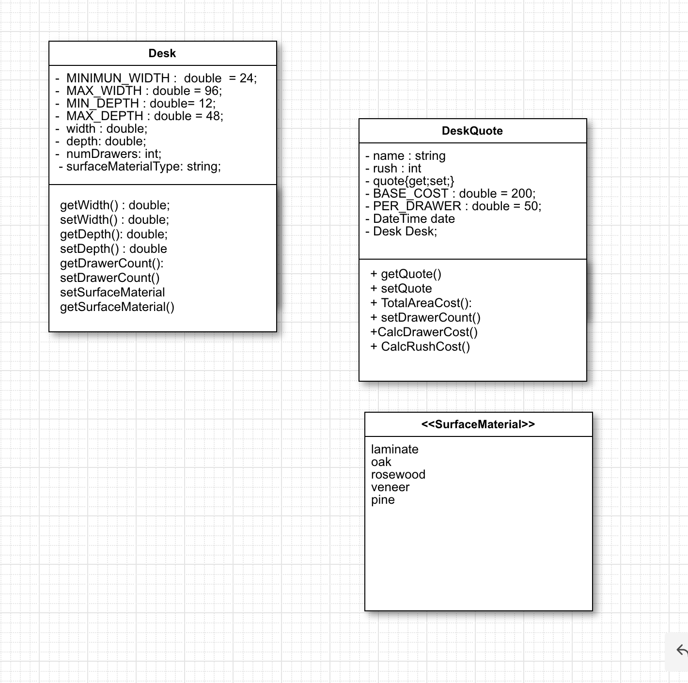

# MegaDesk Design - Isabel Aranguren

```
Desk() {
    private const double MINIMUN_WIDTH; = 24;
    private const double MAX_WIDTH = 96;
    private const double MIN_DEPTH; = 12;
    private const double MAX_DEPTH = 48;
    private double width;
    private double depth;
    private int numDrawers;
    private string surfaceMaterialType;
}
```

```
DeskQuote() {
    private datetime date;
    private string name;
    private double finalPrice;
    private double rushOrderPrice;
    private int productionTimeDays = 14;
    private double const BASE_PRICE = 200;
    private double const COST_PER_DRAWER = 50;
    double surfaceAreaPrice = 0;
    string surfaceMaterialType;
    double surfaceMaterialPrice = 0;

}
```

``` 
Public DeskQuote() {
    // add TotalAreaCost, CalcDrawerCost, CalcRushCost, and CalcSurfaceCost}
```
```
Public int TotalAreaCost(){
    //if area > 1000, calculate and add cost to BASE_ COST or just return BASE_COST}
```
```
Public int CalcDrawerCost(){
    // Calculates drawers cost 
    }
```
```
Public int CalcRushCost(){
    // Returns to different cost depending the rush 
}
```    
```
Public int CalcSurfaceCost(){
    // return total cost Given material }
```
