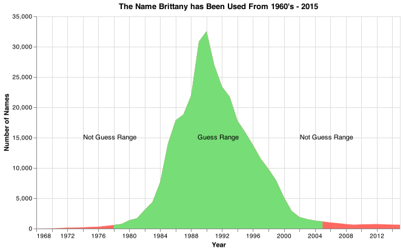
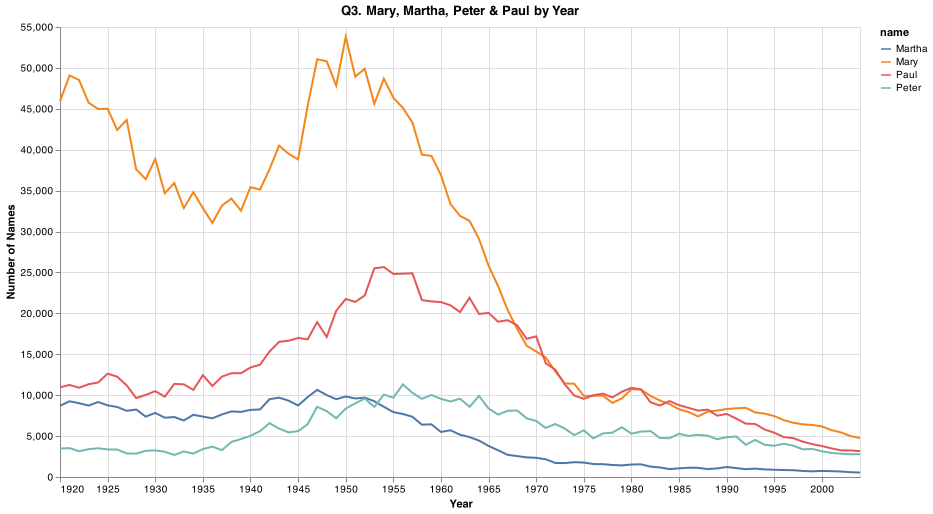

# Client Report - What's your name

**Course CSE 250**
**Isabel Aranguren**

## Elevator pitch
_Popular names come and go, the fastest rising or falling baby names mirror cultural trends, changing fashions or world events.What's your name is an analysis made by using the data world baby names by states. Using Altair package and pandas, see how the given names from the last few decades were influenced by movies and trends_

### GRAND QUESTION 1

#### # 1. How does your name at your birth year compare to its use historically?
_The name Isabel according to this dataset, started to grow exponentially in the 1990s and early 2000s. In my birth year, it was and at one of its highest points. It reached its final peak in the year 2003, and its popularity has been decreasing ever since._

##### TECHNICAL DETAILS
```python
# %%
my_name = df.query("name == 'Isabel'")
isabel_chart = (alt.Chart(my_name, title="Popularity")
    .encode(
        alt.X('year(year):T', title = "Year"),
        alt.Y('Total:Q',title="Number of Names")
    )
    .mark_bar().properties(width=700,height=350)
)

# %%
my_year = pd.DataFrame({
    'year' : [2001],
    'Total' : [my_name.query("year == 2001").Total.values[0]],
    'label' : ["Birth Year"]})

# %%
my_year.Total = my_year.Total.astype("int64",copy=True)
my_year.year = pd.to_datetime(my_year.year,format='%Y')

# %%
text_overlay = (alt.Chart(my_year).mark_text(align='right',dy=-10,baseline='middle')
    .encode
    (
        x = alt.X('year'),
        y = alt.Y('Total:Q'),
        text = 'label'
    )
)

# %%
my_point = (alt.Chart(my_year).mark_circle(color = 'red')
    .encode
    (
        x = alt.X('year'                                        ),
        y = alt.Y('Total:Q')
    )
)

# %%
isabel_point = isabel_chart  + text_overlay + my_point
isabel_point.save("my_point.png")
```


```python
numOfIsabelByBirthYear = df.query('name == "Isabel" & year == 2001') # 3468 Isabel's in 2001

print(numOfIsabelByBirthYear
    .head()
    .filter(["name", "year", "Total"])
    .to_markdown(index=False))
```

_The name Isabel has been used a total of 3486 times in the year 2001_

| name   | year                |   Total |
|:-------|:--------------------|--------:|
| Isabel | 2001-01-01 00:00:00 |    3486 |

### GRAND QUESTION 2

#### 2. If you talked to someone named Brittany on the phone, what is your guess of their age? What ages would you not guess?

_The name Brittany, according to this dataset, was popular from 1978-2000. If I were to guess what age she is, given the year is 2021, her age is most likely between 30 and 16 years old. Due to the absence of the name from 1968, she couldn't be older than 51._

##### TECHNICAL DETAILS

```python
base = (alt.Chart(brit, title="The Name Brittany has Been Used From 1960's - 2015")
    .mark_area(color="#ff6961")
    .encode(
        x = alt.X('year', title="Year"),
        y = alt.Y('Total', title="Number of Names")
    )
    .properties(width=600,height=350)
)
```


```python
print(brit
    .head(5)
    .filter(["name", "year", "Total"])
    .to_markdown(index=False))
```

| name     | year                |   Total |
|:---------|:--------------------|--------:|
| Brittany | 1968-01-01 00:00:00 |       5 |
| Brittany | 1969-01-01 00:00:00 |      12 |
| Brittany | 1970-01-01 00:00:00 |      32 |
| Brittany | 1971-01-01 00:00:00 |      81 |
| Brittany | 1972-01-01 00:00:00 |     158 |


### GRAND QUESTION 3

#### 3. Mary, Martha, Peter, and Paul are all Christian names. From 1920 - 2000, compare the name usage of each of the four names.

_Looking at the naming trend over these years, you might conclude that some old-fashioned names have grown out of favor with the American population. According to the figure all of these names are in decline. Mary experienced peak diversity in the 1950’s, but its popularity has been decreasing over the past 4 decades. The name "Paul" peaked in 1955, but not as high as Mary. Peter was at its peak from the late 1950s to the early 1960s. The name Martha is the least popular of all, peaking in the late 1940s and steadily declining ever since_

##### TECHNICAL DETAILS

```python
# Subset the data
mmpp = df.query('name in ["Mary","Martha","Peter","Paul"] & year > 1919 & year < 2005')

# Chart the subset
mmppChart = (alt.Chart(mmpp, title='Q3. Mary, Martha, Peter & Paul by Year')
              .encode(
                  alt.X('year(year):T', title = "Year"),
                  alt.Y('Total',title="Number of Names"),
                  color = 'name')
              .mark_line()).properties(width=800,height=450)
mmppChart.save('mmppChart.png')


```
_The following chart shows comparison between the names Mary, Martha, Peter & Paul between the years 1920 & 2020_





```python
print(mmpp
    .head(5)
    .to_markdown(index=False))
```

| name   | year                |   AK |   AL |   AR |   AZ |   CA |   CO |   CT |   DC |   DE |   FL |   GA |   HI |   IA |   ID |   IL |   IN |   KS |   KY |   LA |   MA |   MD |   ME |   MI |   MN |   MO |   MS |   MT |   NC |   ND |   NE |   NH |   NJ |   NM |   NV |   NY |   OH |   OK |   OR |   PA |   RI |   SC |   SD |   TN |   TX |   UT |   VA |   VT |   WA |   WI |   WV |   WY |   Total |
|:-------|:--------------------|-----:|-----:|-----:|-----:|-----:|-----:|-----:|-----:|-----:|-----:|-----:|-----:|-----:|-----:|-----:|-----:|-----:|-----:|-----:|-----:|-----:|-----:|-----:|-----:|-----:|-----:|-----:|-----:|-----:|-----:|-----:|-----:|-----:|-----:|-----:|-----:|-----:|-----:|-----:|-----:|-----:|-----:|-----:|-----:|-----:|-----:|-----:|-----:|-----:|-----:|-----:|--------:|
| Martha | 1920-01-01 00:00:00 |   11 |  258 |  224 |   21 |  131 |   66 |   55 |   20 |   23 |   81 |  501 |   17 |  131 |   29 |  355 |  460 |  134 |  401 |  114 |  135 |   98 |   33 |  190 |  124 |  254 |  187 |   36 |  398 |   61 |   56 |   16 |  136 |   35 |    0 |  407 |  670 |  169 |   30 |  857 |   19 |  227 |   33 |  416 |  418 |   16 |  269 |   11 |   73 |  116 |  172 |   11 |    8705 |
| Martha | 1921-01-01 00:00:00 |    0 |  307 |  216 |   18 |  161 |   70 |   57 |   34 |   18 |   83 |  523 |    0 |  139 |   28 |  393 |  536 |  124 |  407 |  130 |  119 |   98 |   37 |  199 |  105 |  300 |  190 |   37 |  428 |   62 |   83 |   20 |  118 |   48 |    0 |  402 |  744 |  186 |   36 |  849 |   28 |  279 |   43 |  420 |  478 |   20 |  297 |   13 |   57 |  101 |  204 |    9 |    9254 |
| Martha | 1922-01-01 00:00:00 |    9 |  326 |  219 |   23 |  126 |   67 |   56 |   17 |   13 |  103 |  533 |    9 |  142 |   18 |  364 |  497 |  129 |  386 |  149 |  109 |  109 |   31 |  192 |   90 |  292 |  220 |   20 |  453 |   47 |   57 |   15 |  109 |   40 |    0 |  427 |  675 |  201 |   29 |  799 |   24 |  278 |   37 |  421 |  501 |   18 |  273 |   14 |   39 |   82 |  225 |    5 |    9018 |
| Martha | 1923-01-01 00:00:00 |    0 |  341 |  236 |   27 |  159 |   63 |   38 |   24 |   10 |  130 |  450 |   10 |  131 |   15 |  335 |  490 |  137 |  425 |  138 |  121 |   87 |   30 |  194 |   88 |  292 |  232 |   27 |  447 |   51 |   62 |   14 |  138 |   30 |    0 |  395 |  690 |  168 |   32 |  808 |   19 |  275 |   34 |  442 |  233 |   22 |  293 |   11 |   45 |   72 |  210 |   10 |    8731 |
| Martha | 1924-01-01 00:00:00 |    0 |  342 |  257 |   39 |  166 |   58 |   49 |   23 |   11 |  124 |  541 |   15 |  133 |   20 |  372 |  511 |  141 |  456 |  120 |  121 |   83 |   35 |  164 |   76 |  285 |  215 |   38 |  455 |   45 |   45 |   19 |  111 |   40 |    6 |  420 |  729 |  186 |   41 |  811 |   14 |  318 |   20 |  507 |  487 |   15 |  155 |   15 |   41 |   72 |  196 |   20 |    9163 |

### GRAND QUESTION 4

#### 4. Think of a unique name from a famous movie. Plot that name and see how increases line up with the movie release.

_According to the dataset, the name Bella started to rise to the top of the charts in 2010, probably because of the release of the "Twilight" book and movie series._

##### TECHNICAL DETAILS

```python
# The following chart shows the popularity of the name Bella
characterName = df.query('name == "Bella" & year >= 2007 & year <= 2020') 
characterNameChart = (alt.Chart(characterName)
                        .encode(
                             alt.X('year', title = "Year"),
                             alt.Y('Total', title="Number of Names"))
                        .mark_line()).properties(width=600,height=450, title="Q4. Bella Swan from Twilight") 

```

_insert your chart png here_


```python
# 
print(characterName
      .head()
      .filter(["name", "year", "Total"])
      .to_markdown(index=False))
```

_Bella Swan from Twilight_
| name   | year                |   Total |
|:-------|:--------------------|--------:|
| Bella  | 2007-01-01 00:00:00 |    2234 |
| Bella  | 2008-01-01 00:00:00 |    2778 |
| Bella  | 2009-01-01 00:00:00 |    4530 |
| Bella  | 2010-01-01 00:00:00 |    5109 |
| Bella  | 2011-01-01 00:00:00 |    4257 |


## APPENDIX A (PYTHON CODE)

```python
# To add a new cell, type '# %%'
# To add a new markdown cell, type '# %% [markdown]'
# %% [markdown]
# 
# # Grand Questions:
# 1. How does your name at your birth year compare to its use historically?
# 2. If you talked to someone named Brittany on the phone, what is your guess of their age? What ages would you not guess?
# 3. Mary, Martha, Peter, and Paul are all Christian names. From 1920 - 2000, compare the name usage of each of the four names.
# 4. Think of a unique name from a famous movie. Plot that name and see how increases line up with the movie release.
# 

# %%
# Imports
import altair as alt
import numpy as np
import pandas as pd

# %% [markdown]
# ## 1. How does your name at your birth year compare to its use historically?

# %%
# Read in data
url = 'https://github.com/byuidatascience/data4names/raw/master/data-raw/names_year/names_year.csv'
df = pd.read_csv(url)


# %%
df.head()
df.year = pd.to_datetime(df.year, format='%Y')
df_agg = df.groupby('name')
df_agg.head()
my_name = df.query("name == 'Isabel'")
my_name.head(-10)


# %%
numOfIsabelByBirthYear = df.query('name == "Isabel" & year == 2001') # 3468 Isabel's in 2001
numOfIsabelByBirthYear.head()

print(numOfIsabelByBirthYear
    .head()
    .filter(["name", "year", "Total"])
    .to_markdown(index=False))


# %%
isabel_chart = (alt.Chart(my_name, title="Popularity")
    .encode(
        alt.X('year(year):T', title = "Year"),
        alt.Y('Total:Q',title="Number of Names")
    )
    .mark_bar().properties(width=700,height=350)
)


# %%
my_year = pd.DataFrame({
    'year' : [2001],
    'Total' : [my_name.query("year == 2001").Total.values[0]],
    'label' : ["Birth Year"]})


# %%
my_year.Total = my_year.Total.astype("int64",copy=True)
my_year.year = pd.to_datetime(my_year.year,format='%Y')


# %%
# TEXT 
text_overlay = (alt.Chart(my_year).mark_text(align='right',dy=-10,baseline='middle')
    .encode
    (
        x = alt.X('year'),
        y = alt.Y('Total:Q'),
        text = 'label'
    )
)


# %%
my_point = (alt.Chart(my_year).mark_circle(color = 'red')
    .encode
    (
        x = alt.X('year'                                        ),
        y = alt.Y('Total:Q')
    )
)


# %%
isabel_point = isabel_chart  + text_overlay + my_point
isabel_point
# isabel_point.save("my_point.png")

# %% [markdown]
# The name Isabel has been used a total of 3486 times in the year 2001
# %% [markdown]
# <!--  -->
# %% [markdown]
# ## 2. If you talked to someone named Brittany on the phone, what is your guess of their age? What ages would you not guess?

# %%
# Subset the data

brit = df.query("name == 'Brittany'")


# %%
britStd = pd.DataFrame({
    'year' : [brit.year.median() + (brit.year.std()),brit.year.median() - (brit.year.std()),brit.year.median()],
    'color' : ['red','green','red'],
    'text' : ["Not Guess Range","Not Guess Range","Guess Range"],
    'y' : [15000]* 3
})


# %%
base = (alt.Chart(brit, title="The Name Brittany has Been Used From 1960's - 2015")
    .mark_area(color="#ff6961")
    .encode(
        x = alt.X('year', title="Year"),
        y = alt.Y('Total', title="Number of Names")
    )
    .properties(width=600,height=350)
)


# %%
area = (alt.Chart(brit.query("(year < @britStd.year.values[0]) & (year > @britStd.year.values[1])"))
    .mark_area(color='#77dd77')
    .encode(
        alt.X('year'),
        alt.Y('Total')
       )
    )


# %%
overlay = (alt.Chart(britStd)
    .mark_text()
    .encode(
        x = 'year',
        y = 'y',
        text = 'text'
    )
)


# %%
print(brit
    .head(5)
    .filter(["name", "year", "Total"])
    .to_markdown(index=False))


# %%
britChart = base + area + overlay
britChart.save("brit_final.png")

# %% [markdown]
# ## 3. Mary, Martha, Peter, and Paul are all Christian names. From 1920 - 2000, compare the name usage of each of the four names.

# %%
# Subset the data
mmpp = df.query('name in ["Mary","Martha","Peter","Paul"] & year > 1919 & year < 2005').to_markdown(index=False))


# %%
print(mmpp
    .head(5)
    .to_markdown(index=False))


# %%
# Chart the subset
mmppChart = (alt.Chart(mmpp, title='Q3. Mary, Martha, Peter & Paul by Year')
              .encode(
                  alt.X('year(year):T', title = "Year"),
                  alt.Y('Total',title="Number of Names"),
                  color = 'name')
              .mark_line()).properties(width=800,height=450)
mmppChart.save('mmppChart.png') # Save chart

# %% [markdown]
# 
# %% [markdown]
# ## 4. Think of a unique name from a famous movie. Plot that name and see how increases line up with the movie release.

# %%
characterName = df.query('name == "Bella" & year >= 2007 & year <= 2020') 
characterNameChart = (alt.Chart(characterName)
                        .encode(
                             alt.X('year', title = "Year"),
                             alt.Y('Total', title="Number of Names"))
                        .mark_line()).properties(width=600,height=450, title="Q4. Bella Swan from Twilight")


# %%


print(characterName
      .head()
      .filter(["name", "year", "Total"])
      .to_markdown(index=False))


# %%
release_year = pd.DataFrame({
    'year' : [2008],
    'Total' : [characterName.query("year == 2008").Total.values[0]],
    'label' : ["Release Year"]})


# %%
release_year.Total = release_year.Total.astype("int64",copy=True)
release_year.year = pd.to_datetime(release_year.year,format='%Y')


# %%
chracterNameChart = (alt.Chart(release_year).mark_circle(color = 'red')
    .encode
    (
        x = alt.X('year', title = "Year"),
        y = alt.Y('Total:Q')
    )
)


# %%
text_overlay = (alt.Chart(release_year).mark_text(align='right',dy=-10,baseline='middle')
    .encode
    (
        x = alt.X('year'),
        y = alt.Y('Total:Q'),
        text = 'label'
    )
)


# %%
bella_chart = chracterNameChart  + characterNameChart + text_overlay
bella_chart.save('bella_chart.png') # Save chart

# %% [markdown]
# 


```
