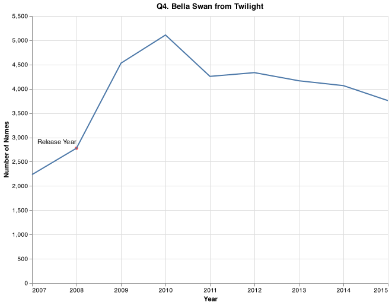

# Client Report - What's your name

**Course CSE 250**
**Isabel Aranguren**

## Elevator pitch

_paste your elevator pitch here_

### GRAND QUESTION 1

#### # 1. How does your name at your birth year compare to its use historically?

_If we take a look at the chart we can tell that on my birth year it was starting to gain popularity_

##### TECHNICAL DETAILS

```python

# %%
my_name = df.query("name == 'Isabel'")
isabel_chart = (alt.Chart(my_name, title="Popularity")
    .encode(
        alt.X('year(year):T', title = "Year"),
        alt.Y('Total:Q',title="Number of Names")
    )
    .mark_bar().properties(width=700,height=350)
)

# %%
my_year = pd.DataFrame({
    'year' : [2001],
    'Total' : [my_name.query("year == 2001").Total.values[0]],
    'label' : ["Birth Year"]})

# %%
my_year.Total = my_year.Total.astype("int64",copy=True)
my_year.year = pd.to_datetime(my_year.year,format='%Y')

# %%
text_overlay = (alt.Chart(my_year).mark_text(align='right',dy=-10,baseline='middle')
    .encode
    (
        x = alt.X('year'),
        y = alt.Y('Total:Q'),
        text = 'label'
    )
)

# %%
my_point = (alt.Chart(my_year).mark_circle(color = 'red')
    .encode
    (
        x = alt.X('year'                                        ),
        y = alt.Y('Total:Q')
    )
)

# %%
isabel_point = isabel_chart  + text_overlay + my_point
isabel_point.save("my_point.png")
```

_insert your chart png here_


```python
numOfIsabelByBirthYear = df.query('name == "Isabel" & year == 2001') # 3468 Isabel's in 2001
numOfIsabelByBirthYear.head()
```

_replace the table below with your table_

|     | animal  |
| --: | :------ |
|   0 | elk     |
|   1 | pig     |
|   2 | dog     |
|   3 | quetzal |

### GRAND QUESTION 2

#### # 2. If you talked to someone named Brittany on the phone, what is your guess of their age? What ages would you not guess?

_type your results and analysis here_

##### TECHNICAL DETAILS

```python
#paste chart code in this snippet box
```

_insert your chart png here_


```python
#paste your table code in this snippet box
```

_replace the table below with your table_


### GRAND QUESTION 3

#### COPY PASTE GRAND QUESTION 3 FROM THE PROJECT HERE

_type your results and analysis here_

##### TECHNICAL DETAILS

```python
#paste chart code in this snippet box
```

_insert your chart png here_


```python
#paste your table code in this snippet box
```

_replace the table below with your table_
| | animal |
|---:|:---------|
| 0 | elk |
| 1 | pig |
| 2 | dog |
| 3 | quetzal |

### GRAND QUESTION 4

#### COPY PASTE GRAND QUESTION 4 FROM THE PROJECT HERE

_type your results and analysis here_

##### TECHNICAL DETAILS

```python
#paste chart code in this snippet box
```

_insert your chart png here_


```python
#paste your table code in this snippet box
```

_replace the table below with your table_
| | animal |
|---:|:---------|
| 0 | elk |
| 1 | pig |
| 2 | dog |
| 3 | quetzal |

### GRAND QUESTION 5

#### COPY PASTE GRAND QUESTION 5 FROM THE PROJECT HERE

_type your results and analysis here_

##### TECHNICAL DETAILS

```python
#paste chart code in this snippet box
```

_insert your chart png here_


```python
#paste your table code in this snippet box
```

_replace the table below with your table_
| | animal |
|---:|:---------|
| 0 | elk |
| 1 | pig |
| 2 | dog |
| 3 | quetzal |

## APPENDIX A (PYTHON CODE)

```python
# %%
# Imports
import altair as alt
import numpy as np
import pandas as pd

# %% [markdown]
# ## 1. How does your name at your birth year compare to its use historically?

# %%
# Read in data
url = 'https://github.com/byuidatascience/data4names/raw/master/data-raw/names_year/names_year.csv'
df = pd.read_csv(url)


# %%
df.head()
df.year = pd.to_datetime(df.year, format='%Y')
df_agg = df.groupby('name')
df_agg.head()
my_name = df.query("name == 'Isabel'")
my_name.head()


# %%
numOfIsabelByBirthYear = df.query('name == "Isabel" & year == 2001') # 3468 Isabel's in 2001
numOfIsabelByBirthYear.head()


# %%
isabel_chart = (alt.Chart(my_name, title="Popularity")
    .encode(
        alt.X('year(year):T', title = "Year"),
        alt.Y('Total:Q',title="Number of Names")
    )
    .mark_bar().properties(width=700,height=350)
)


# %%
my_year = pd.DataFrame({
    'year' : [2001],
    'Total' : [my_name.query("year == 2001").Total.values[0]],
    'label' : ["Birth Year"]})


# %%
my_year.Total = my_year.Total.astype("int64",copy=True)
my_year.year = pd.to_datetime(my_year.year,format='%Y')


# %%
text_overlay = (alt.Chart(my_year).mark_text(align='right',dy=-10,baseline='middle')
    .encode
    (
        x = alt.X('year'),
        y = alt.Y('Total:Q'),
        text = 'label'
    )
)


# %%
my_point = (alt.Chart(my_year).mark_circle(color = 'red')
    .encode
    (
        x = alt.X('year'                                        ),
        y = alt.Y('Total:Q')
    )
)


# %%
isabel_point = isabel_chart  + text_overlay + my_point
isabel_point
# isabel_point.save("my_point.png")

# %% [markdown]
# The name Isabel has been used a total of 3486 times in the year 2001
# %% [markdown]
# <!--  -->
# %% [markdown]
# ## 2. If you talked to someone named Brittany on the phone, what is your guess of their age? What ages would you not guess?

# %%
brit = df.query("name == 'Brittany'")
britStd = pd.DataFrame({
    'year' : [brit.year.median() + (brit.year.std()),brit.year.median() - (brit.year.std()),brit.year.median()],
    'color' : ['red','green','red'],
    'text' : ["Not Guess Range","Not Guess Range","Guess Range"],
    'y' : [15000]* 3
})


# %%
base = (alt.Chart(brit, title="The Name Brittany has Been Used From 1960's - 2015")
    .mark_area(color="#ff6961")
    .encode(
        x = alt.X('year', title="Year"),
        y = alt.Y('Total', title="Number of Names")
    )
    .properties(width=600,height=350)
)


# %%
area = (alt.Chart(brit.query("(year < @britStd.year.values[0]) & (year > @britStd.year.values[1])"))
    .mark_area(color='#77dd77')
    .encode(
        alt.X('year'),
        alt.Y('Total')
       )
    )


# %%
overlay = (alt.Chart(britStd)
    .mark_text()
    .encode(
        x = 'year',
        y = 'y',
        text = 'text'
    )
)


# %%
britChart = base + area + overlay
britChart.save("brit_final.png")

# %% [markdown]
# ## 3. Mary, Martha, Peter, and Paul are all Christian names. From 1920 - 2000, compare the name usage of each of the four names.

# %%
# Subset the data
mmpp = df.query('name in ["Mary","Martha","Peter","Paul"] & year > 1919 & year < 2005')


# %%
# Chart the subset
mmppChart = (alt.Chart(mmpp, title='Q3. Mary, Martha, Peter & Paul by Year')
              .encode(
                  alt.X('year(year):T', title = "Year"),
                  alt.Y('Total',title="Number of Names"),
                  color = 'name')
              .mark_line()).properties(width=800,height=450)
mmppChart.save('mmppChart.png')

# %% [markdown]
# 
# %% [markdown]
# ## 4. Think of a unique name from a famous movie. Plot that name and see how increases line up with the movie release.

# %%
characterName = df.query('name == "Bella" & year >= 2007 & year <= 2020')
characterNameChart = (alt.Chart(characterName)
                        .encode(
                             alt.X('year', title = "Year"),
                             alt.Y('Total', title="Number of Names"))
                        .mark_line()).properties(width=600,height=450, title="Q4. Bella Swan from Twilight")


# %%
release_year = pd.DataFrame({
    'year' : [2008],
    'Total' : [characterName.query("year == 2008").Total.values[0]],
    'label' : ["Release Year"]})


# %%
release_year.Total = release_year.Total.astype("int64",copy=True)
release_year.year = pd.to_datetime(release_year.year,format='%Y')


# %%
chracterNameChart = (alt.Chart(release_year).mark_circle(color = 'red')
    .encode
    (
        x = alt.X('year', title = "Year"),
        y = alt.Y('Total:Q')
    )
)


# %%
text_overlay = (alt.Chart(release_year).mark_text(align='right',dy=-10,baseline='middle')
    .encode
    (
        x = alt.X('year'),
        y = alt.Y('Total:Q'),
        text = 'label'
    )
)


# %%
bella_chart = chracterNameChart  + characterNameChart + text_overlay
bella_chart.save('bella_chart.png') # Save chart

# %% [markdown]
# 


```
