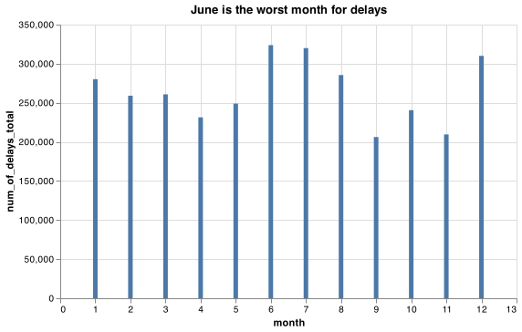
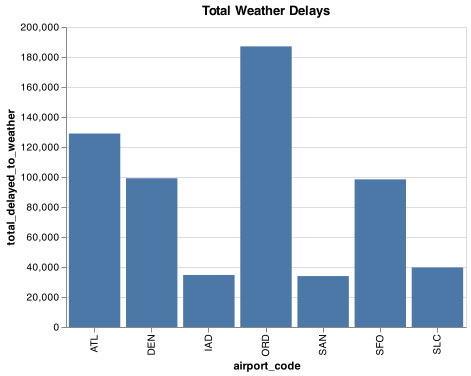

# Client Report - Are we missing JSON on our flight? 
**Course CSE 250**
**Isabel Aranguren**


## Elevator pitch

Delayed flights are not something most people look forward to.  In 2003 the Bureau of Transportation Statistics (BTS) began collecting data on the causes of delayed flights. The categories they use are Air Carrier, National Aviation System, Weather, Late-Arriving Aircraft, and Security. 
The task of this project is to clean the data, and search for insights about flight delays, 

## TECHNICAL DETAILS

### GRAND QUESTION 1

#### Which airport has the worst delays? How did you choose to define “worst”? As part of your answer include a table that lists the total number of flights, total number of delayed flights, proportion of delayed flights, and average delay time in hours, for each airport.

- I would define "worst delays" as length of the delay in minutes/hours.

Total flights per airport
 airport_code

| ATL | 4430047 |
|-----|---------|
| ORD | 3597588 |
| DEN | 2513974 |
| SFO | 1630945 |
| SLC | 1403384 |
| SAN | 917862  |
| IAD | 851571  |

Name: num_of_flights_total, dtype: int64 

Total delays per airport
 airport_code

| ATL | 902443 |
|-----|--------|
| ORD | 830825 |
| DEN | 468519 |
| SFO | 425604 |
| SLC | 205160 |
| SAN | 175132 |
| IAD | 168467 |

Name: num_of_delays_total, dtype: int64 

Delay Percentage
 airport_code
| SFO | 0.260955 |
|-----|----------|
| ORD | 0.230939 |
| ATL | 0.203710 |
| IAD | 0.197831 |
| SAN | 0.190804 |
| DEN | 0.186366 |
| SLC | 0.146189 |
dtype: float64

ORD average delay is 66 minutes
SFO average delay is 61 minutes
IAD average delay is 60 minutes
ATL average delay is 59 minutes
DEN average delay is 53 minutes
SLC average delay is 49 minutes
SAN average delay is 47 minutes

ALT also has the most number of delays at 902,443, however, it's percentage of delayed flights is 20.37% with an average delay time of 59 minutes per delay.
The worst would be ORD (Chicago) with 3,597,588 flights, and 830,825 delays for an average of 23.09% flights delayed at an average length of 66 minutes.

### GRAND QUESTION 2

#### What is the worst month to fly if you want to avoid delays? Include one chart to help support your answer, with the x-axis ordered by month. You also need to explain and justify how you chose to handle the missing Month data.

* As we can see in the chart above, June is the worst month for delays at the airports observed.




### GRAND QUESTION 3

#### According to the BTS website the Weather category only accounts for severe weather delays. Other “mild” weather delays are included as part of the NAS category and the Late-Arriving Aircraft category. Calculate the total number of flights delayed by weather (either severe or mild) using these two rules:

#### 3a. 30% of all delayed flights in the Late-Arriving category are due to weather.

* All delayed flights in the Late-Arriving category, both num_of_delays_nas & num_of_delays_late_aircraft equals 622,016.

#### 3b. From April to August, 40% of delayed flights in the NAS category are due to weather. The rest of the months, the proportion rises to 65%.

* From April to August, 40% of flights are delayed, which equals 276,195.

* From September to March, 65% of flights are delayed, which equals 345,820.

### GRAND QUESTION 4

#### Create a barplot showing the proportion of all flights that are delayed by weather at each airport. What do you learn from this graph (Careful to handle the missing Late Aircraft data correctly)?

* See the chart above




### GRAND QUESTION 5

#### Fix all of the varied NA types in the data to be consistent and save the file back out in the same format that was provided (this file shouldn’t have the missing values replaced with a value). Include one record example from your exported JSON file that has a missing value (No imputation in this file).

```python3
import json
  
# Opening JSON file
file = open('final_product.json',)
  
# returns JSON object as 
# a dictionary
data = json.load(f)
print(data['num_of_delays_carrier']['0'])
# Closing file
file.close()
```

---


## APPENDIX

```python
# # Grand Question 1:
# ## 1. Which airport has the worst delays? How did you choose to define “worst”? As part of your answer include a table that lists the total number of flights, total number of delayed flights, proportion of delayed flights, and average delay time in hours, for each airport.

# %%
# Imports
import pandas as pd
import altair as alt
import numpy as np
import urllib3
import json

url_flights = 'https://github.com/byuidatascience/data4missing/raw/master/data-raw/flights_missing/flights_missing.json'
http = urllib3.PoolManager()
response = http.request('GET', url_flights)
flights_json = json.loads(response.data.decode('utf-8'))
flights = pd.json_normalize(flights_json)


# %%

# Loading data
flights_url = "https://github.com/byuidatascience/data4missing/raw/master/data-raw/flights_missing/flights_missing.json"
df = pd.read_json(flights_url)
# df

# Check for nulls with `df.isna().sum()`

df = df.fillna(df.mean())
q1_df = df.copy()
# print(q1_df.isna().sum())


# Total flights per airport
flightsPerAirport = (
    q1_df.groupby("airport_code")
    .num_of_flights_total.sum()
    .sort_values(ascending=False)
)
print("Total flights per airport\n", flightsPerAirport, "\n")

# Total delays per airport
delaysPerAirport = (
    q1_df.groupby("airport_code").num_of_delays_total.sum().sort_values(ascending=False)
)
print("Total delays per airport\n", delaysPerAirport, "\n")

# Add proportion of delayed flights column
q1_df["proportion_of_delayed_flights"] = q1_df.apply(
    lambda x: x["num_of_flights_total"] / x["num_of_delays_total"], axis=1
)

# Average delay length
q1_df["delay_length_average"] = q1_df.apply(
    lambda x: x["minutes_delayed_total"] / x["num_of_delays_total"], axis=1
)

# Subset
q1_df = q1_df[
    [
        "airport_code",
        "num_of_flights_total",
        "num_of_delays_total",
        "proportion_of_delayed_flights",
        "minutes_delayed_total",
        "delay_length_average",
    ]
]

# Individualize the airports
q1_df_ORD = q1_df.query('airport_code == "ORD"')
q1_df_SFO = q1_df.query('airport_code == "SFO"')
q1_df_IAD = q1_df.query('airport_code == "IAD"')
q1_df_ATL = q1_df.query('airport_code == "ATL"')
q1_df_DEN = q1_df.query('airport_code == "DEN"')
q1_df_SLC = q1_df.query('airport_code == "SLC"')
q1_df_SAN = q1_df.query('airport_code == "SAN"')

# Get delay average in minutes
q1_df_ORD_delays = q1_df_ORD["delay_length_average"].sum() / len(q1_df_ORD)
q1_df_SFO_delays = q1_df_SFO["delay_length_average"].sum() / len(q1_df_SFO)
q1_df_IAD_delays = q1_df_IAD["delay_length_average"].sum() / len(q1_df_IAD)
q1_df_ATL_delays = q1_df_ATL["delay_length_average"].sum() / len(q1_df_ATL)
q1_df_DEN_delays = q1_df_DEN["delay_length_average"].sum() / len(q1_df_DEN)
q1_df_SLC_delays = q1_df_SLC["delay_length_average"].sum() / len(q1_df_SLC)
q1_df_SAN_delays = q1_df_SAN["delay_length_average"].sum() / len(q1_df_SAN)

# Delay Percentage/Proportion
delay_percentage = (delaysPerAirport / flightsPerAirport).sort_values(
    ascending=False
)
print("Delay Percentage\n", delay_percentage)
print()

# Print delay averages
print(f"ORD average delay is {q1_df_ORD_delays:.0f} minutes")
print(f"SFO average delay is {q1_df_SFO_delays:.0f} minutes")
print(f"IAD average delay is {q1_df_IAD_delays:.0f} minutes")
print(f"ATL average delay is {q1_df_ATL_delays:.0f} minutes")
print(f"DEN average delay is {q1_df_DEN_delays:.0f} minutes")
print(f"SLC average delay is {q1_df_SLC_delays:.0f} minutes")
print(f"SAN average delay is {q1_df_SAN_delays:.0f} minutes")
print()

# Turn delay_percentage to dict
delay_pct_dict = delay_percentage.to_dict()

# Worst delay airport
most_by = 4430047 - 3597588
atl_pct = 902443 / 4430047

print(
    f"""ATL (Atlanta) has the most flights by {most_by:,} thousand, which is 
quite significant. They top out at {4430047:,} flights. ALT also has 
the most number of delays at {902443:,}, however, it's percentage 
of delayed flights is {delay_pct_dict['ATL']*100:.02f}% with an average delay time of 
{q1_df_ATL_delays:.0f} minutes per delay.\n
The airport with the worst delays 
would be ORD (Chicago) with {3597588:,} flights, and {830825:,} delays for an 
average of {delay_pct_dict['ORD']*100:.02f}% flights delayed at an average length of 
{q1_df_ORD_delays:.0f} minutes."""
)

# %% [markdown]
# # Grand Question 2:
# ## What is the worst month to fly if you want to avoid delays? Include one chart to help support your answer, with the x-axis ordered by month. You also need to explain and justify how you chose to handle the missing Month data.

# %%
# Loading data
flights = df.copy()

# Convert month column to numeric
## After examining the data, I should make the `n/a` data to match the above month
ls = []

for i in flights["month"]:
    ls.append(i)

for i in range(len(ls)):
    if ls[i] == "n/a":
        ls[i] = ls[i - 1]

flights["month"] = ls

# Convert string month to numeric
def monthToNum(shortMonth):
    return {
        "January": 1,
        "Febuary": 2,
        "March": 3,
        "April": 4,
        "May": 5,
        "June": 6,
        "July": 7,
        "August": 8,
        "September": 9,
        "October": 10,
        "November": 11,
        "December": 12,
    }[shortMonth]


# Convert the data to numeric data
flights["month"] = flights["month"].apply(lambda x: monthToNum(x))

# Organize with groupby month
total_delays_per_month = (
    flights.groupby("month").num_of_delays_total.sum().sort_values(ascending=False)
)

# Convert to DF for charting
dfx = pd.DataFrame([total_delays_per_month]).T

# Fix indexing issue
dfx["month"] = dfx.index
dfx.reset_index(drop=True, inplace=True)

# Format the way I want
dfx = dfx[["month", "num_of_delays_total"]]

# Just in case it comes in handy later
# months = ['January','Febuary','March','April','May','June','July','August','September','October','November','December']

# Chart
delaysPerMonthChart = (
    alt.Chart(dfx)
    .encode(x="month", y="num_of_delays_total")
    .mark_bar()
    .properties(width=500, title="June is the worst month for delays")
)

# Results
print(
    "June is the worst month for delays at the airports observed.\n"
)

# SAVE CHART
delaysPerMonthChart.save("delaysPerMonthChart.png")
delaysPerMonthChart

# %% [markdown]
# # Grand Question 3:
# ## According to the BTS website the Weather category only accounts for severe weather delays. Other “mild” weather delays are included as part of the NAS category and the Late-Arriving Aircraft category. Calculate the total number of flights delayed by weather (either severe or mild) using these two rules:
# ### 3a. 30% of all delayed flights in the Late-Arriving category are due to weather.
# ### 3b. From April to August, 40% of delayed flights in the NAS category are due to weather. The rest of the months, the proportion rises to 65%.
# %% [markdown]
# #### 30% of all delayed flights in the Late-Arriving category are due to weather.

# %%
# Understand the question
# “mild” weather delays are included as part of the NAS (minutes_delayed_nas, num_of_delays_nas)
# category and the Late-Arriving Aircraft (minutes_delayed_late_aircraft, num_of_delays_late_aircraft)


# %%
# Using "mild" weather, which is a combination of num_of_delays_nas & num_of_delays_late_aircraft, 30% are due to weather.

# Copy data
flights_q3 = df.copy()
flights_q3 = flights_q3[
    ["airport_code", "month", "num_of_delays_nas", "num_of_delays_late_aircraft"]
]


print(flights_q3[["num_of_delays_late_aircraft"]].value_counts().head(1))

# o extract the undesired infection
flights_q3 = flights_q3[flights_q3["num_of_delays_late_aircraft"] != -999]

# There are no longer 40 instances of -999 values in the dataframe
print(flights_q3[["num_of_delays_late_aircraft"]].value_counts().head(1))

# Make a "combined" column
flights_q3["combined"] = flights_q3["num_of_delays_nas"] + flights_q3["num_of_delays_late_aircraft"]

# Total flights delayed by weather is 30% of "combined"
flights_q3["total_delayed_to_weather"] = flights_q3["combined"] * 0.3


# 3a
answer = int(flights_q3["total_delayed_to_weather"].sum().round())
print(
    f"""All delayed flights in the Late-Arriving category, both num_of_delays_nas 
& num_of_delays_late_aircraft equals {answer:,}."""
)

# %% [markdown]
# #### From April to August, 40% of delayed flights in the NAS category are due to weather. The rest of the months, the proportion rises to 65%.

# %%
# Fill in the n/a months using the code above
ls = []
for i in flights_q3["month"]:
    ls.append(i)
for i in range(len(ls)):
    if ls[i] == "n/a":
        ls[i] = ls[i - 1]
flights_q3["month"] = ls

# Set it up
## Use "combined" column to get real numbers, not "total_delayed_to_weather" as
## it's already calculated.
b3 = flights_q3.groupby(by="month").combined.sum().round()

# Make the DF to subset from
b3 = pd.DataFrame([b3]).T

# Fix indexing issue and make months numeric
b3["month"] = dfx.index + 1
b3.reset_index(drop=True, inplace=True)

month_nums_a = [4, 5, 6, 7, 8]  # 30%
month_nums_b = [1, 2, 3, 9, 10, 11, 12]  # 65%

# month_nums_a
b3a = b3.loc[b3["month"].isin(month_nums_a)]
b3a_answer = int(b3a["combined"].sum() * 0.3)
print(
    f"From April to August, 40% of flights are delayed, which equals {b3a_answer:,}.\n"
)

# month_nums_b
b3b = b3.loc[b3["month"].isin(month_nums_b)]
b3b_answer = int(b3b["combined"].sum() * 0.3)
print(
    f"From September to March, 65% of flights are delayed, which equals {b3b_answer:,}."
)

# %% [markdown]
# # Grand Question 4:
# ## Create a barplot showing the proportion of all flights that are delayed by weather at each airport. What do you learn from this graph (Careful to handle the missing Late Aircraft data correctly)?

# %%
# Group things together
weatherDelayPerAirport = (
    flights_q3.groupby("airport_code")
    .total_delayed_to_weather.sum()
    .sort_values(ascending=False)
)

# Convert to DF for charting
dfx = pd.DataFrame([weatherDelayPerAirport]).T

# Fix indexing issue
dfx["airport_code"] = dfx.index
dfx.reset_index(drop=True, inplace=True)
dfx = dfx[["airport_code", "total_delayed_to_weather"]]


# %%
chart = (
    alt.Chart(dfx)
    .encode(x=alt.X("airport_code"), y=alt.Y("total_delayed_to_weather"))
    .mark_bar()
    .properties(width=400, title="Total Weather Delays")
)

# Save chart
chart.save("total_delayed_to_weather.png")
chart

# %% [markdown]
# # Grand Question 5:
# ## Fix all of the varied NA types in the data to be consistent and save the file back out in the same format that was provided (this file shouldn’t have the missing values replaced with a value). Include one record example from your exported JSON file that has a missing value (No imputation in this file).

# %%
df = pd.read_json(flights_url)

flights_q5 = df.copy()


# %%
flights_q5


# %%
# Check airport_code for shenanigans
print(flights_q5["airport_code"].unique())  # Nothing suspicious going on (as printed)


# %%
# Check airport_code 
for i in flights_q5["airport_name"].unique():
    print(i)  # Something is blank... let's fix that
flights_q5["airport_name"] = flights_q5["airport_name"].replace("", np.nan)

# See update of what's going on
print(flights_q5.isna().sum())


# %%
# Normalize everything the hard way
flights_q5["year"] = flights_q5["year"].replace("nan", np.nan)
flights_q5["year"] = flights_q5["year"].replace("n/a", np.nan)
flights_q5["year"] = flights_q5["year"].replace("", np.nan)

flights_q5["month"] = flights_q5["month"].replace("nan", np.nan)
flights_q5["month"] = flights_q5["month"].replace("n/a", np.nan)
flights_q5["month"] = flights_q5["month"].replace("", np.nan)

flights_q5["num_of_flights_total"] = flights_q5["num_of_flights_total"].replace("nan", np.nan)
flights_q5["num_of_flights_total"] = flights_q5["num_of_flights_total"].replace("n/a", np.nan)
flights_q5["num_of_flights_total"] = flights_q5["num_of_flights_total"].replace("", np.nan)

flights_q5["num_of_delays_carrier"] = flights_q5["num_of_delays_carrier"].replace("nan", np.nan)
flights_q5["num_of_delays_carrier"] = flights_q5["num_of_delays_carrier"].replace("n/a", np.nan)
flights_q5["num_of_delays_carrier"] = flights_q5["num_of_delays_carrier"].replace("", np.nan)
flights_q5["num_of_delays_carrier"] = flights_q5["num_of_delays_carrier"].replace("1500+", np.nan)

flights_q5["num_of_delays_late_aircraft"] = flights_q5["num_of_delays_late_aircraft"].replace(
    "nan", np.nan
)
flights_q5["num_of_delays_late_aircraft"] = flights_q5["num_of_delays_late_aircraft"].replace(
    "n/a", np.nan
)
flights_q5["num_of_delays_late_aircraft"] = flights_q5["num_of_delays_late_aircraft"].replace(
    -999, np.nan
)
flights_q5["num_of_delays_late_aircraft"] = flights_q5["num_of_delays_late_aircraft"].replace(
    "", np.nan
)

flights_q5["num_of_delays_nas"] = flights_q5["num_of_delays_nas"].replace("nan", np.nan)
flights_q5["num_of_delays_nas"] = flights_q5["num_of_delays_nas"].replace("n/a", np.nan)
flights_q5["num_of_delays_nas"] = flights_q5["num_of_delays_nas"].replace("", np.nan)

flights_q5["num_of_delays_security"] = flights_q5["num_of_delays_security"].replace("nan", np.nan)
flights_q5["num_of_delays_security"] = flights_q5["num_of_delays_security"].replace("n/a", np.nan)
flights_q5["num_of_delays_security"] = flights_q5["num_of_delays_security"].replace("", np.nan)

flights_q5["num_of_delays_weather"] = flights_q5["num_of_delays_weather"].replace("nan", np.nan)
flights_q5["num_of_delays_weather"] = flights_q5["num_of_delays_weather"].replace("n/a", np.nan)
flights_q5["num_of_delays_weather"] = flights_q5["num_of_delays_weather"].replace("", np.nan)

flights_q5["num_of_delays_total"] = flights_q5["num_of_delays_total"].replace("nan", np.nan)
flights_q5["num_of_delays_total"] = flights_q5["num_of_delays_total"].replace("n/a", np.nan)
flights_q5["num_of_delays_total"] = flights_q5["num_of_delays_total"].replace("", np.nan)

flights_q5["minutes_delayed_carrier"] = flights_q5["minutes_delayed_carrier"].replace(
    "nan", np.nan
)
flights_q5["minutes_delayed_carrier"] = flights_q5["minutes_delayed_carrier"].replace(
    "n/a", np.nan
)
flights_q5["minutes_delayed_carrier"] = flights_q5["minutes_delayed_carrier"].replace("", np.nan)

flights_q5["minutes_delayed_late_aircraft"] = flights_q5["minutes_delayed_late_aircraft"].replace(
    "nan", np.nan
)
flights_q5["minutes_delayed_late_aircraft"] = flights_q5["minutes_delayed_late_aircraft"].replace(
    "n/a", np.nan
)
flights_q5["minutes_delayed_late_aircraft"] = flights_q5["minutes_delayed_late_aircraft"].replace(
    "", np.nan
)

flights_q5["minutes_delayed_nas"] = flights_q5["minutes_delayed_nas"].replace("nan", np.nan)
flights_q5["minutes_delayed_nas"] = flights_q5["minutes_delayed_nas"].replace("n/a", np.nan)
flights_q5["minutes_delayed_nas"] = flights_q5["minutes_delayed_nas"].replace("", np.nan)

flights_q5["minutes_delayed_security"] = flights_q5["minutes_delayed_security"].replace(
    "nan", np.nan
)
flights_q5["minutes_delayed_security"] = flights_q5["minutes_delayed_security"].replace(
    "n/a", np.nan
)
flights_q5["minutes_delayed_security"] = flights_q5["minutes_delayed_security"].replace(
    "", np.nan
)

flights_q5["minutes_delayed_weather"] = flights_q5["minutes_delayed_weather"].replace(
    "nan", np.nan
)
flights_q5["minutes_delayed_weather"] = flights_q5["minutes_delayed_weather"].replace(
    "n/a", np.nan
)
flights_q5["minutes_delayed_weather"] = flights_q5["minutes_delayed_weather"].replace("", np.nan)

flights_q5["minutes_delayed_total"] = flights_q5["minutes_delayed_total"].replace("nan", np.nan)
flights_q5["minutes_delayed_total"] = flights_q5["minutes_delayed_total"].replace("n/a", np.nan)
flights_q5["minutes_delayed_total"] = flights_q5["minutes_delayed_total"].replace("", np.nan)


# %%
# df = df.fillna(df.mean())
flights_q5.isna().sum()


# %%
viewJson = flights_q5.to_json()
print(viewJson)
flights_q5.to_json(r"final_product.json")


# %%

# Opening JSON file
file = open(
    "final_product.json",
)

# returns JSON object as
# a dictionary
data = json.load(f)

# print(data["num_of_delays_carrier"]["0"])

# Closing file
file.close()
# %%%

```