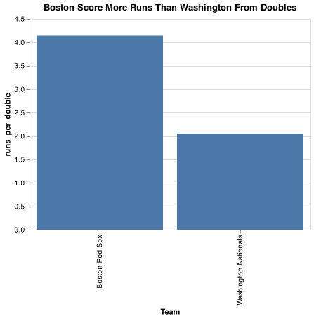

# Client Report - Finding relationships in baseball
__Course CSE 250__
__Isabel Aranguren__

## Elevator pitch

Data is just information. Data for a particular entity or user can be stored in a container called a relational database. 
The purpose of this project is to find the relationship in baseball with players salary, batting average and their hits using data.world as our remote server. Finally,  the chart made with the  dataset from datdata.world provides a comparison of the Arizona Diamondbacks vs the San Diego Padres and their runs scored from doubles

### GRAND QUESTION 1
#### Write an SQL query to create a new dataframe about baseball players who attended BYU-Idaho. The new table should contain five columns: playerID, schoolID, salary, and the yearID/teamID associated with each salary. Order the table by salary (highest to lowest) and print out the table in your report.

_According to the database, the highest salary was $4000000 in 2014_
##### TECHNICAL DETAILS

```python 

result = dw.query('byuidss/cse-250-baseball-database', 
    '''
    SELECT 
    p.playerid
    , c.schoolid
    , s.salary
    , s.yearid
    , s.teamid
    FROM people p
    JOIN collegeplaying c ON p.playerid = c.playerid
    JOIN salaries s on c.playerid = s.playerid
    WHERE c.schoolid = 'idbyuid'
    ORDER BY s.salary DESC
    ;
    ''')
```

```python 
table = result.dataframe
print(table.head(3).to_markdown())
table
```

|    | playerid   | schoolid   |   salary |   yearid | teamid   |
|---:|:-----------|:-----------|---------:|---------:|:---------|
|  0 | lindsma01  | idbyuid    |  4000000 |     2014 | CHA      |
|  1 | lindsma01  | idbyuid    |  4000000 |     2014 | CHA      |
|  2 | lindsma01  | idbyuid    |  3600000 |     2012 | BAL      |

### GRAND QUESTION 2
#### This three-part question requires you to calculate batting average (number of hits divided by the number of at-bats)

#### a. Write an SQL query that provides playerID, yearID, and batting average for players with at least one at bat. Sort the table from highest batting average to lowest, and show the top 5 results in your report.


##### TECHNICAL DETAILS

```python 
result = dw.query('byuidss/cse-250-baseball-database', 
    '''
    SELECT 
    playerid
    , yearid
    , h/ab AS batting_average
    FROM batting
    WHERE h >= 1
    ORDER BY batting_average DESC
    LIMIT 5
    ;
    ''')
```

```python 
table = result.dataframe
print(table.head(5).to_markdown())
table

```
|    | playerid   |   yearid |   batting_average |
|---:|:-----------|---------:|------------------:|
|  0 | mccafsp01  |     1889 |                 1 |
|  1 | snowch01   |     1874 |                 1 |
|  2 | oconnfr01  |     1893 |                 1 |
|  3 | gumbebi01  |     1893 |                 1 |
|  4 | baldwki01  |     1884 |                 1 |


#### b. Use the same query as above, but only include players with more than 10 “at bats” that year. Print the top 5 results.

```python 

result = dw.query('byuidss/cse-250-baseball-database', 
    '''
    SELECT 
    playerid
    , yearid
    , h/ab AS batting_average
    FROM batting
    WHERE ab >= 1
    ORDER BY batting_average DESC
    LIMIT 5
    ;
    ''')
```

```python 
table = result.dataframe
print(table.head(5).to_markdown())
table

```

|    | playerid   |   yearid |   batting_average |
|---:|:-----------|---------:|------------------:|
|  0 | snowch01   |     1874 |                 1 |
|  1 | baldwki01  |     1884 |                 1 |
|  2 | oconnfr01  |     1893 |                 1 |
|  3 | gumbebi01  |     1893 |                 1 |
|  4 | mccafsp01  |     1889 |                 1 |


#### c. Now calculate the batting average for players over their entire careers (all years combined). Only include players with more than 100 at bats, and print the top 5 results.


```python
result = dw.query('byuidss/cse-250-baseball-database', 
    '''
    SELECT p.namefirst, p.namelast, SUM(b.h) as hits, SUM(b.ab) AS at_bat, SUM(b.h)/SUM(b.ab) AS bat_avg
    FROM people p
    JOIN batting b ON p.playerid = b.playerid
    WHERE b.ab > 100
    GROUP BY p.playerid
    ORDER BY bat_avg DESC
    LIMIT 5
    ;    
   ''')
```

```python 
table = result.dataframe
print(table.head(5).to_markdown())
table

```

|    | namefirst   | namelast   |   hits |   at_bat |   bat_avg |
|---:|:------------|:-----------|-------:|---------:|----------:|
|  0 | Bob         | Hazle      |     54 |      134 |  0.402985 |
|  1 | Curt        | Davis      |     40 |      105 |  0.380952 |
|  2 | Showboat    | Fisher     |     95 |      254 |  0.374016 |
|  3 | Rynie       | Wolters    |     51 |      138 |  0.369565 |
|  4 | Ty          | Cobb       |   4189 |    11436 |  0.366299 |

### GRAND QUESTION 3
#### Pick any two baseball teams and compare them using a metric of your choice (average salary, home runs, number of wins, etc.). Write an SQL query to get the data you need. Use Python if additional data wrangling is needed, then make a graph in Altair to visualize the comparison. Provide the visualization and its description.

_RED SOX VS NATIONALS_

##### TECHNICAL DETAILS

```python 
result = dw.query('byuidss/cse-250-baseball-database', 
 '''
    -- At Bat vs Triples with Runs Scored

    SELECT    f.franchname AS Team
            , t.teamid
            , t.ab AS at_bat
            , t.2b AS doubles
            , t.r AS runs_scored
            , t.2b/t.ab AS doubles_by_at_bat
            , t.r/t.2b AS runs_per_double
    FROM teams t
    JOIN teamsfranchises f ON t.franchid = f.franchid
    WHERE f.active = "Y" AND t.teamid = "WAS" OR t.teamid = "BOS"
    GROUP BY f.franchname
    ORDER BY runs_scored DESC
    ;
   ''')

table = result.dataframe
print(table.head().to_markdown())
```

|    | Team                 | teamid   |   at_bat |   doubles |   runs_scored |   doubles_by_at_bat |   runs_per_double |
|---:|:---------------------|:---------|---------:|----------:|--------------:|--------------------:|------------------:|
|  0 | Boston Red Sox       | BOS      |     4866 |       183 |           759 |           0.0376079 |           4.14754 |
|  1 | Washington Nationals | WAS      |     5426 |       311 |           639 |           0.0573166 |           2.05466 |

_Boston Red Sox scores more than Washington Nationals per each double hit._


```python 
chart = (
    alt.Chart(table)
    .encode(
        alt.X('Team'),
        alt.Y('runs_per_double'))
    .mark_bar()
    .properties(width=400, title="Boston Score More Runs Than Washington From Doubles")
)
chart.save('chart.png')
```

## APPENDIX A (PYTHON CODE)
```python
# To add a new cell, type '# %%'
# To add a new markdown cell, type '# %% [markdown]'
# %%
import datadotworld as dw
import pandas as pd
import altair as alt

# %% [markdown]
# ## GRAND QUESTION 1
# ### Write an SQL query to create a new dataframe about baseball players who attended BYU-Idaho. The new table should contain five columns: playerID, schoolID, salary, and the yearID/teamID associated with each salary. Order the table by salary (highest to lowest) and print out the table in your report.

# %%
#  The WHERE keyword allows us to filter down the table horizontally (fewer rows).
result = dw.query('byuidss/cse-250-baseball-database', 
    '''
    SELECT 
    p.playerid
    , c.schoolid
    , s.salary
    , s.yearid
    , s.teamid
    FROM people p
    JOIN collegeplaying c ON p.playerid = c.playerid
    JOIN salaries s on c.playerid = s.playerid
    WHERE c.schoolid = 'idbyuid'
    ORDER BY s.salary DESC
    ;
    ''')


# %%
table = result.dataframe
print(table.head(3).to_markdown())

# %% [markdown]
# ## GRAND QUESTION 2
# ### This three-part question requires you to calculate batting average (number of hits divided by the number of at-bats)
# %% [markdown]
#  a. Write an SQL query that provides playerID, yearID, and batting average for players with at least one at bat. Sort the table from highest batting average to lowest, and show the top 5 results in your report.
# 

# %%
# LIMIT is used in a query to return up to a specific number of rows in the results and comes after the WHERE clause if there is one
#  AS introduces the column name you would like to see in the results of a query.
result = dw.query('byuidss/cse-250-baseball-database', 
    '''
    SELECT 
    playerid
    , yearid
    , h/ab AS batting_average
    FROM batting
    WHERE h >= 1
    ORDER BY batting_average DESC
    LIMIT 5
    ;
    ''')

table = result.dataframe
print(table.head(5).to_markdown())

# %% [markdown]
# b. Use the same query as above, but only include players with more than 10 “at bats” that year. Print the top 5 results.
# 

# %%
result = dw.query('byuidss/cse-250-baseball-database', 
    '''
    SELECT 
    playerid
    , yearid
    , h/ab AS batting_average
    FROM batting
    WHERE ab >= 1
    ORDER BY batting_average DESC
    LIMIT 5
    ;
    ''')

table = result.dataframe
print(table.head(5).to_markdown())

# %% [markdown]
# c. Now calculate the batting average for players over their entire careers (all years combined). Only include players with more than 100 at bats, and print the top 5 results.

# %%
result = dw.query('byuidss/cse-250-baseball-database', 
    '''
    SELECT p.namefirst, p.namelast, SUM(b.h) as hits, SUM(b.ab) AS at_bat, SUM(b.h)/SUM(b.ab) AS bat_avg
    FROM people p
    JOIN batting b ON p.playerid = b.playerid
    WHERE b.ab > 100
    GROUP BY p.playerid
    ORDER BY bat_avg DESC
    LIMIT 5
    ;    
   ''')

table = result.dataframe
print(table.head(5).to_markdown())

# %% [markdown]
# ## GRAND QUESTION 3
# ### Pick any two baseball teams and compare them using a metric of your choice (average salary, home runs, number of wins, etc.). Write an SQL query to get the data you need. Use Python if additional data wrangling is needed, then make a graph in Altair to visualize the comparison. Provide the visualization and its description.

# %%
result = dw.query('byuidss/cse-250-baseball-database', 
 '''
    SELECT    f.franchname AS Team
            , t.teamid
            , t.ab AS at_bat
            , t.2b AS doubles
            , t.r AS runs_scored
            , t.2b/t.ab AS doubles_by_at_bat
            , t.r/t.2b AS runs_per_double
    FROM teams t
    JOIN teamsfranchises f ON t.franchid = f.franchid
    WHERE f.active = "Y" AND t.teamid = "WAS" OR t.teamid = "BOS"
    GROUP BY f.franchname
    ORDER BY runs_scored DESC
    ;
   ''')

table = result.dataframe
print(table.head().to_markdown())


# %%
# Chart
chart = (
    alt.Chart(table)
    .encode(
        alt.X('Team'),
        alt.Y('runs_per_double'))
    .mark_bar()
    .properties(width=400, title="Boston Score More Runs Than Washington From Doubles")
)
chart.save('chart.png')

```