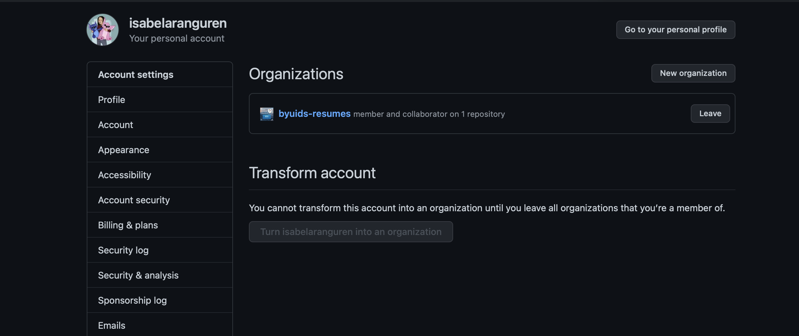
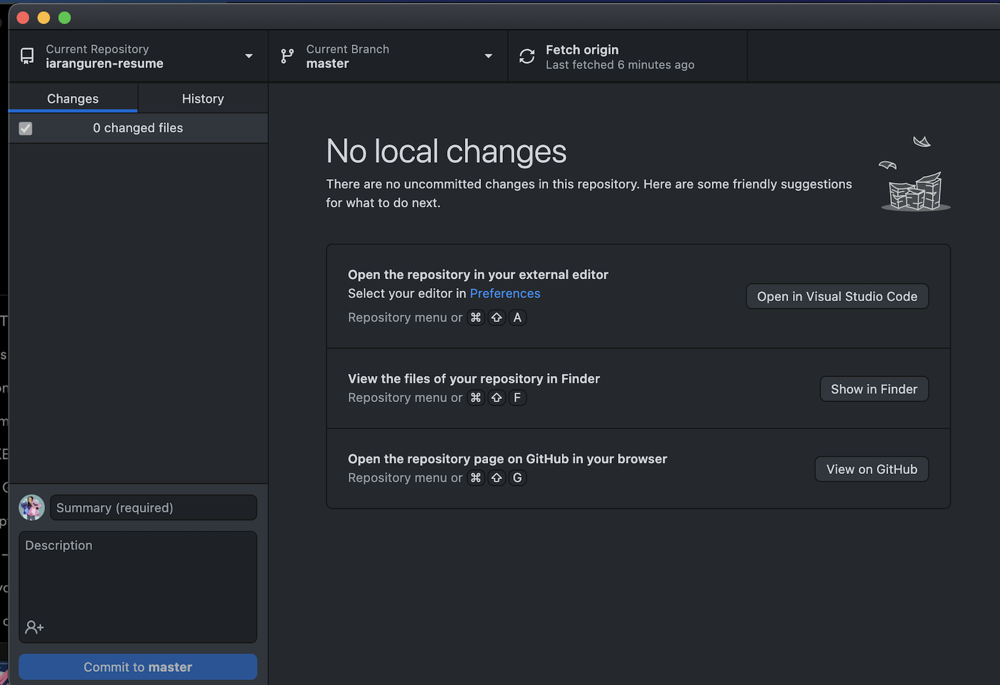
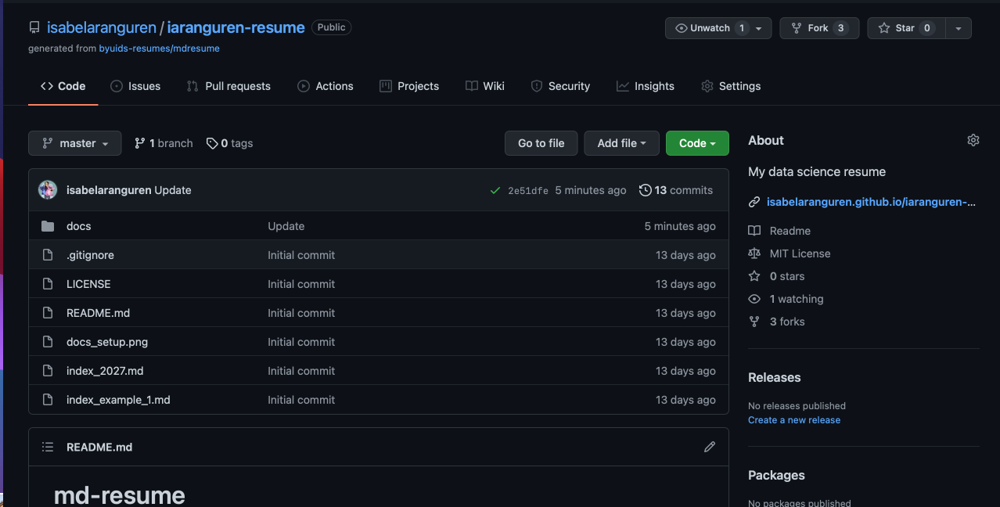
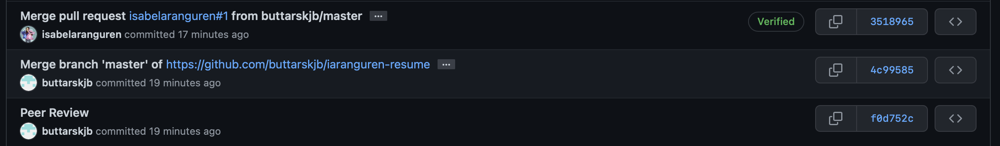
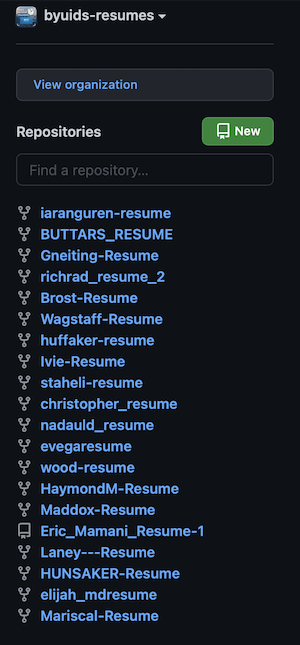

# Client Report - Project 6: Git your resume online
__Course CSE 250__
__Isabel Aranguren__

## Elevator pitch

Using a template from the BYUI Data Science GitHub Organization, I made a public resume that is hosted on GitHub. In the process of this project, I used the Git process to have others in the class to edit my resumes.

### GRAND QUESTION 1
#### Join the BYUI Data Science Resumes GitHub organization and use the template repository to make a resume repository under your repositories. A good name might be LASTNAME-Resume.

### GRAND QUESTION 2
#### Clone your repository to your computer and build a first draft of your resume.

### GRAND QUESTION 3
### Push your results to GitHub and have another student fork your repository to make edits.

### GRAND QUESTION 4
### Accept the proposed changes from the student review and finish your final version.

### GRAND QUESTION 5
### Make sure your resume is forked by BYU-I Data Science Resumes

##### TECHNICAL DETAILS
[Demo](https://isabelaranguren.github.io/iaranguren-resume/)
